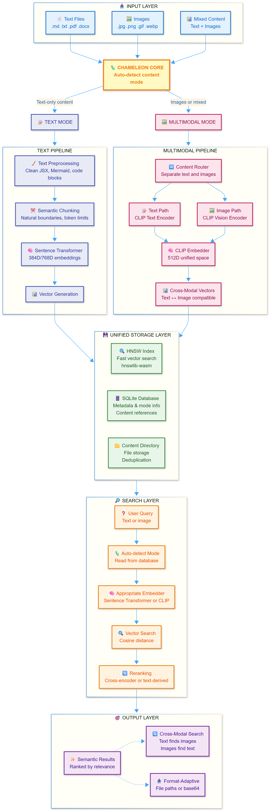

<div align="center">

# 🦎 RAG-lite TS

### *Simple by default, powerful when needed*

**Local-first semantic search that actually works**

[](https://www.npmjs.com/package/rag-lite-ts)
[](https://opensource.org/licenses/MIT)
[](https://www.typescriptlang.org/)
[](https://nodejs.org/)

[Quick Start](#quick-start) • [Features](#features) • [Documentation](#documentation) • [Examples](#examples) • [MCP Integration](#mcp-server-integration)

</div>

---

## 🎯 Why RAG-lite TS?

**Stop fighting with complex RAG frameworks.** Get semantic search running in 30 seconds:

```bash
npm install -g rag-lite-ts
raglite ingest ./docs/
raglite search "your query here"
```

**That's it.** No API keys, no cloud services, no configuration hell.

### 🎬 See It In Action

```typescript
// 1. Ingest your docs
const pipeline = new IngestionPipeline('./db.sqlite', './index.bin');
await pipeline.ingestDirectory('./docs/');

// 2. Search semantically
const search = new SearchEngine('./index.bin', './db.sqlite');
const results = await search.search('authentication flow');

// 3. Get relevant results instantly
console.log(results[0].text);
// "To authenticate users, first obtain a JWT token from the /auth endpoint..."
```

**Real semantic understanding** - not just keyword matching. Finds "JWT token" when you search for "authentication flow".

### What Makes It Different?

- 🏠 **100% Local** - Your data never leaves your machine
- 🚀 **Actually Fast** - Sub-100ms queries, not "eventually consistent"
- 🦎 **Chameleon Architecture** - Automatically adapts between text and multimodal modes
- 🖼️ **True Multimodal** - Search images with text, text with images (CLIP unified space)
- 📦 **Zero Runtime Dependencies** - No Python, no Docker, no external services
- 🎯 **TypeScript Native** - Full type safety, modern ESM architecture
- 🔌 **MCP Ready** - Built-in Model Context Protocol server for AI agents



---

## 🎉 What's New in 2.0

**Chameleon Multimodal Architecture** - RAG-lite TS now seamlessly adapts between text-only and multimodal search:

### 🖼️ Multimodal Search
- **CLIP Integration** - Unified 512D embedding space for text and images
- **Cross-Modal Search** - Find images with text queries, text with image queries
- **Image-to-Text Generation** - Automatic descriptions using vision-language models
- **Smart Reranking** - Text-derived, metadata-based, and hybrid strategies

### 🏗️ Architecture Improvements
- **Layered Architecture** - Clean separation: core (model-agnostic) → implementation (text/multimodal) → public API
- **Mode Persistence** - Configuration stored in database, auto-detected during search
- **Unified Content System** - Memory-based ingestion for AI agents, format-adaptive retrieval
- **Simplified APIs** - `createEmbedder()` and `createReranker()` replace complex factory patterns

### 🤖 MCP Server Enhancements
- **Multimodal Tools** - `multimodal_search`, `ingest_image` with URL download
- **Base64 Image Delivery** - Automatic encoding for AI agent integration
- **Content-Type Filtering** - Filter results by text, image, pdf, docx
- **Dynamic Tool Descriptions** - Context-aware tool documentation

### 📦 Migration from 1.x
Existing databases need schema updates for multimodal support. Two options:
1. **Automatic Migration**: Use `migrateToRagLiteStructure()` function
2. **Fresh Start**: Re-ingest content with v2.0.0

See [CHANGELOG.md](CHANGELOG.md) for complete details.

---

## 📋 Table of Contents

- [Why RAG-lite TS?](#-why-rag-lite-ts)
- [Quick Start](#-quick-start)
- [Features](#-features)
- [Real-World Examples](#-real-world-examples)
- [How It Works](#-how-it-works)
- [Supported Models](#-supported-models)
- [Documentation](#-documentation)
- [MCP Server Integration](#-mcp-server-integration)
- [Development](#-development)
- [Contributing](#-contributing)
- [License](#-license)

## 🚀 Quick Start

### Installation

```bash
npm install -g rag-lite-ts
```

### Basic Usage

```bash
# Ingest documents
raglite ingest ./docs/

# Search your documents
raglite search "machine learning concepts"

# Get more results with reranking
raglite search "API documentation" --top-k 10 --rerank
```

### Using Different Models

```bash
# Use higher quality model (auto-rebuilds if needed)
raglite ingest ./docs/ --model Xenova/all-mpnet-base-v2 --rebuild-if-needed

# Search automatically uses the correct model
raglite search "complex query"
```

### Content Retrieval and MCP Integration

```typescript
import { SearchEngine, IngestionPipeline } from 'rag-lite-ts';

// Memory-based ingestion for AI agents
const pipeline = new IngestionPipeline('./db.sqlite', './index.bin');
const content = Buffer.from('Document from AI agent');
await pipeline.ingestFromMemory(content, {
  displayName: 'agent-document.txt'
});

// Format-adaptive content retrieval
const search = new SearchEngine('./index.bin', './db.sqlite');
const results = await search.search('query');

// Get file path for CLI clients
const filePath = await search.getContent(results[0].contentId, 'file');

// Get base64 content for MCP clients
const base64 = await search.getContent(results[0].contentId, 'base64');
```

### Multimodal Search (Text + Images)

RAG-lite TS now supports true multimodal search using CLIP's unified embedding space, enabling cross-modal search between text and images:

```bash
# Enable multimodal processing for text and image content
raglite ingest ./docs/ --mode multimodal

# Cross-modal search: Find images using text queries
raglite search "architecture diagram" --content-type image
raglite search "red sports car" --content-type image

# Find text documents about visual concepts
raglite search "user interface design" --content-type text

# Search across both content types (default)
raglite search "system overview"

# Use different reranking strategies for optimal results
raglite ingest ./docs/ --mode multimodal --rerank-strategy text-derived
```

**Key Features:**
- **Unified embedding space**: Text and images embedded in the same 512-dimensional CLIP space
- **Cross-modal search**: Text queries find semantically similar images
- **Automatic mode detection**: Set mode once during ingestion, automatically detected during search
- **Multiple reranking strategies**: text-derived, metadata, hybrid, or disabled
- **Seamless experience**: Same CLI commands work for both text-only and multimodal content

→ **[Complete Multimodal Tutorial](docs/multimodal-tutorial.md)**

### Programmatic Usage

```typescript
import { SearchEngine, IngestionPipeline } from 'rag-lite-ts';

// Text-only mode (default)
const ingestion = new IngestionPipeline('./db.sqlite', './vector-index.bin');
await ingestion.ingestDirectory('./docs/');

// Multimodal mode (text + images)
const multimodalIngestion = new IngestionPipeline('./db.sqlite', './index.bin', {
  mode: 'multimodal',
  embeddingModel: 'Xenova/clip-vit-base-patch32',
  rerankingStrategy: 'text-derived'
});
await multimodalIngestion.ingestDirectory('./mixed-content/');

// Search (mode auto-detected from database)
const search = new SearchEngine('./vector-index.bin', './db.sqlite');
const results = await search.search('machine learning', { top_k: 10 });

// Cross-modal search in multimodal mode
const imageResults = results.filter(r => r.contentType === 'image');
const textResults = results.filter(r => r.contentType === 'text');
```

### Memory Ingestion & Unified Content System (NEW)

```typescript
// Ingest content directly from memory (perfect for MCP integration)
const content = Buffer.from('# AI Guide\n\nComprehensive AI concepts...');
const contentId = await ingestion.ingestFromMemory(content, {
  displayName: 'AI Guide.md',
  contentType: 'text/markdown'
});

// Retrieve content in different formats based on client needs
const filePath = await search.getContent(contentId, 'file');     // For CLI clients
const base64Data = await search.getContent(contentId, 'base64'); // For MCP clients

// Batch content retrieval for efficiency
const contentIds = ['id1', 'id2', 'id3'];
const contents = await search.getContentBatch(contentIds, 'base64');

// Content management with deduplication
const stats = await ingestion.getStorageStats();
console.log(`Content directory: ${stats.contentDirSize} bytes, ${stats.fileCount} files`);

// Cleanup orphaned content
const cleanupResult = await ingestion.cleanup();
console.log(`Removed ${cleanupResult.removedFiles} orphaned files`);
```

#### Configuration Options

```typescript
import { SearchEngine, IngestionPipeline } from 'rag-lite-ts';

// Custom model configuration
const search = new SearchEngine('./vector-index.bin', './db.sqlite', {
  embeddingModel: 'Xenova/all-mpnet-base-v2',
  enableReranking: true,
  topK: 15
});

// Ingestion with custom settings
const ingestion = new IngestionPipeline('./db.sqlite', './vector-index.bin', {
  embeddingModel: 'Xenova/all-mpnet-base-v2',
  chunkSize: 400,
  chunkOverlap: 80
});
```

→ **[Complete CLI Reference](docs/cli-reference.md)** | **[API Documentation](docs/api-reference.md)**

---

## 💡 Real-World Examples

<details>
<summary><b>🔍 Build a Documentation Search Engine</b></summary>

```typescript
import { SearchEngine, IngestionPipeline } from 'rag-lite-ts';

// Ingest your docs once
const pipeline = new IngestionPipeline('./db.sqlite', './index.bin');
await pipeline.ingestDirectory('./docs/');

// Search instantly
const search = new SearchEngine('./index.bin', './db.sqlite');
const results = await search.search('authentication flow');

results.forEach(r => {
  console.log(`${r.metadata.title}: ${r.text}`);
  console.log(`Relevance: ${r.score.toFixed(3)}\n`);
});
```

**Use case:** Internal documentation, API references, knowledge bases

</details>

<details>
<summary><b>🖼️ Search Images with Natural Language</b></summary>

```bash
# Ingest mixed content (text + images)
raglite ingest ./assets/ --mode multimodal

# Find images using text descriptions
raglite search "architecture diagram" --content-type image
raglite search "team photo" --content-type image
raglite search "product screenshot" --content-type image
```

**Use case:** Digital asset management, photo libraries, design systems

</details>

<details>
<summary><b>🤖 AI Agent with Memory</b></summary>

```typescript
// Agent ingests conversation context
const content = Buffer.from('User prefers dark mode. Uses TypeScript.');
await pipeline.ingestFromMemory(content, {
  displayName: 'user-preferences.txt'
});

// Later, agent retrieves relevant context
const context = await search.search('user interface preferences');
// Agent now knows: "User prefers dark mode"
```

**Use case:** Chatbots, AI assistants, context-aware agents

</details>

<details>
<summary><b>📊 Semantic Code Search</b></summary>

```typescript
// Index your codebase
await pipeline.ingestDirectory('./src/', {
  chunkSize: 500,  // Larger chunks for code
  chunkOverlap: 100
});

// Find code by intent, not keywords
const results = await search.search('authentication middleware');
// Finds relevant code even if it doesn't contain those exact words
```

**Use case:** Code navigation, refactoring, onboarding

</details>

<details>
<summary><b>🔌 MCP Server for Claude/AI Tools</b></summary>

```json
{
  "mcpServers": {
    "my-docs": {
      "command": "raglite-mcp",
      "env": {
        "RAG_DB_FILE": "./docs/db.sqlite",
        "RAG_INDEX_FILE": "./docs/index.bin"
      }
    }
  }
}
```

Now Claude can search your docs directly! Works with any MCP-compatible AI tool.

**Use case:** AI-powered documentation, intelligent assistants

</details>

---

## ✨ Features

<table>
<tr>
<td width="50%">

### 🎯 Developer Experience
- **One-line setup** - `new SearchEngine()` just works
- **TypeScript native** - Full type safety
- **Zero config** - Sensible defaults everywhere
- **Hackable** - Clean architecture, easy to extend

</td>
<td width="50%">

### 🚀 Performance
- **Sub-100ms queries** - Fast vector search
- **Offline-first** - No network calls
- **Efficient chunking** - Smart semantic boundaries
- **Optimized models** - Multiple quality/speed options

</td>
</tr>
<tr>
<td width="50%">

### 🦎 Chameleon Architecture
- **Auto-adapting** - Text or multimodal mode
- **Mode persistence** - Set once, auto-detected
- **No fallbacks** - Reliable or clear failure
- **Polymorphic runtime** - Same API, different modes

</td>
<td width="50%">

### 🖼️ Multimodal Search
- **CLIP unified space** - Text and images together
- **Cross-modal queries** - Text finds images, vice versa
- **Multiple strategies** - Text-derived, metadata, hybrid
- **Seamless experience** - Same commands, more power

</td>
</tr>
<tr>
<td width="50%">

### 🔌 Integration Ready
- **MCP server included** - AI agent integration
- **Memory ingestion** - Direct buffer processing
- **Format-adaptive** - File paths or base64 data
- **Multi-instance** - Run multiple databases

</td>
<td width="50%">

### 🛠️ Production Ready
- **Content management** - Deduplication, cleanup
- **Model compatibility** - Auto-detection, rebuilds
- **Error recovery** - Clear messages, helpful hints
- **Battle-tested** - Used in real applications

</td>
</tr>
</table>

## 🔧 How It Works

RAG-lite TS follows a clean, efficient pipeline:

```
📄 Documents → 🧹 Preprocessing → ✂️ Chunking → 🧠 Embedding → 💾 Storage
                                                                      ↓
🎯 Results ← 🔄 Reranking ← 🔍 Vector Search ← 🧠 Query Embedding ← ❓ Query
```

### Pipeline Steps

| Step | What Happens | Technologies |
|------|--------------|--------------|
| **1. Ingestion** | Reads `.md`, `.txt`, `.pdf`, `.docx`, images | Native parsers |
| **2. Preprocessing** | Cleans JSX, Mermaid, code blocks, generates image descriptions | Custom processors |
| **3. Chunking** | Splits at natural boundaries with token limits | Semantic chunking |
| **4. Embedding** | Converts text/images to vectors | transformers.js |
| **5. Storage** | Indexes vectors, stores metadata | hnswlib + SQLite |
| **6. Search** | Finds similar chunks via cosine similarity | HNSW algorithm |
| **7. Reranking** | Re-scores results for relevance | Cross-encoder/metadata |

### 🦎 Chameleon Architecture

The system **automatically adapts** based on your content:

<table>
<tr>
<td width="50%">

#### 📝 Text Mode
```
Text Docs → Sentence Transformer
              ↓
         384D Vectors
              ↓
      HNSW Index + SQLite
              ↓
    Cross-Encoder Reranking
```

**Best for:** Documentation, articles, code

</td>
<td width="50%">

#### 🖼️ Multimodal Mode
```
Text + Images → CLIP Embedder
                    ↓
              512D Unified Space
                    ↓
          HNSW Index + SQLite
                    ↓
        Text-Derived Reranking
```

**Best for:** Mixed content, visual search

</td>
</tr>
</table>

**🎯 Key Benefits:**
- Set mode **once** during ingestion → Auto-detected during search
- **Cross-modal search** - Text queries find images, image queries find text
- **No fallback complexity** - Each mode works reliably or fails clearly
- **Same API** - Your code doesn't change between modes

→ **[Document Preprocessing Guide](docs/preprocessing.md)** | **[Model Management Details](models/README.md)**

## 🧠 Supported Models

Choose the right model for your use case:

### 📝 Text Mode Models

| Model | Dims | Speed | Quality | Best For |
|-------|------|-------|---------|----------|
| `sentence-transformers/all-MiniLM-L6-v2` ⭐ | 384 | ⚡⚡⚡ | ⭐⭐⭐ | General purpose (default) |
| `Xenova/all-mpnet-base-v2` | 768 | ⚡⚡ | ⭐⭐⭐⭐ | Complex queries, higher accuracy |

### 🖼️ Multimodal Models

| Model | Dims | Speed | Quality | Best For |
|-------|------|-------|---------|----------|
| `Xenova/clip-vit-base-patch32` ⭐ | 512 | ⚡⚡ | ⭐⭐⭐ | Text + images (default) |
| `Xenova/clip-vit-base-patch16` | 512 | ⚡ | ⭐⭐⭐⭐ | Higher visual quality |

### ✨ Model Features

- ✅ **Auto-download** - Models cached locally on first use
- ✅ **Smart compatibility** - Detects model changes, prompts rebuilds
- ✅ **Offline support** - Pre-download for air-gapped environments
- ✅ **Zero config** - Works out of the box with sensible defaults
- ✅ **Cross-modal** - CLIP enables text ↔ image search

→ **[Complete Model Guide](docs/model-guide.md)** | **[Performance Benchmarks](docs/EMBEDDING_MODELS_COMPARISON.md)**

## 📚 Documentation

<table>
<tr>
<td width="33%">

### 🚀 Getting Started
- [CLI Reference](docs/cli-reference.md)
- [API Reference](docs/api-reference.md)
- [Multimodal Tutorial](docs/multimodal-tutorial.md)
- [Unified Content System](docs/unified-content-system.md)

</td>
<td width="33%">

### 🔧 Advanced
- [Configuration Guide](docs/configuration.md)
- [Model Selection](docs/model-guide.md)
- [Multimodal Config](docs/multimodal-configuration.md)
- [Path Strategies](docs/path-strategies.md)

</td>
<td width="33%">

### 🛠️ Support
- [Troubleshooting](docs/troubleshooting.md)
- [Multimodal Issues](docs/multimodal-troubleshooting.md)
- [Content Issues](docs/unified-content-troubleshooting.md)
- [Benchmarks](docs/EMBEDDING_MODELS_COMPARISON.md)

</td>
</tr>
</table>

### 🎯 Quick Start by Role

| I want to... | Start here |
|--------------|------------|
| 🆕 Try it out | [CLI Reference](docs/cli-reference.md) → `npm i -g rag-lite-ts` |
| 🖼️ Search images | [Multimodal Tutorial](docs/multimodal-tutorial.md) → `--mode multimodal` |
| 💻 Build an app | [API Reference](docs/api-reference.md) → `new SearchEngine()` |
| 🤖 Integrate with AI | [MCP Guide](docs/mcp-server-multimodal-guide.md) → `raglite-mcp` |
| ⚡ Optimize performance | [Model Guide](docs/model-guide.md) → Choose your model |
| 🐛 Fix an issue | [Troubleshooting](docs/troubleshooting.md) → Common solutions |

**📖 [Complete Documentation Hub](docs/README.md)**

## 🔌 MCP Server Integration

**Give your AI agents semantic memory.** RAG-lite TS includes a built-in Model Context Protocol (MCP) server.

```bash
# Start MCP server (works with Claude, Cline, and other MCP clients)
raglite-mcp
```

### Single Instance Configuration

**MCP Configuration:**
```json
{
  "mcpServers": {
    "rag-lite": {
      "command": "raglite-mcp",
      "args": []
    }
  }
}
```

### Multiple Instance Configuration (NEW)

Run multiple MCP server instances for different databases with **intelligent routing**:

```json
{
  "mcpServers": {
    "rag-lite-text-docs": {
      "command": "npx",
      "args": ["rag-lite-mcp"],
      "env": {
        "RAG_DB_FILE": "./text-docs/db.sqlite",
        "RAG_INDEX_FILE": "./text-docs/index.bin"
      }
    },
    "rag-lite-multimodal-images": {
      "command": "npx",
      "args": ["rag-lite-mcp"],
      "env": {
        "RAG_DB_FILE": "./mixed-content/db.sqlite",
        "RAG_INDEX_FILE": "./mixed-content/index.bin"
      }
    }
  }
}
```

**Dynamic Tool Descriptions:**
Each server automatically detects and advertises its capabilities:
- `[TEXT MODE]` - Text-only databases clearly indicate supported file types
- `[MULTIMODAL MODE]` - Multimodal databases advertise image support and cross-modal search
- AI assistants can intelligently route queries to the appropriate database

**Available Tools:** `search`, `ingest`, `ingest_image`, `multimodal_search`, `rebuild_index`, `get_stats`, `get_mode_info`, `list_supported_models`, `list_reranking_strategies`, `get_system_stats`

**Multimodal Features:**
- Search across text and image content
- Retrieve image content as base64 data
- Cross-modal search capabilities (text queries find images)
- Automatic mode detection from database
- Content type filtering
- Multiple reranking strategies

→ **[Complete MCP Integration Guide](docs/cli-reference.md#mcp-server)** | **[MCP Multimodal Guide](docs/mcp-server-multimodal-guide.md)** | **[Multi-Instance Setup](docs/mcp-server-multimodal-guide.md#running-multiple-mcp-server-instances)**

---

## 🛠️ Development

### Building from Source

```bash
# Clone and setup
git clone https://github.com/your-username/rag-lite-ts.git
cd rag-lite-ts
npm install

# Build and link for development
npm run build
npm link  # Makes raglite/raglite-mcp available globally

# Run tests
npm test
npm run test:integration
```

### Project Structure

```
src/
├── index.ts              # Main exports and factory functions
├── search.ts             # Public SearchEngine API
├── ingestion.ts          # Public IngestionPipeline API
├── core/                 # Model-agnostic core layer
│   ├── search.ts         # Core search engine
│   ├── ingestion.ts      # Core ingestion pipeline
│   ├── db.ts             # SQLite operations
│   ├── config.ts         # Configuration system
│   ├── content-manager.ts # Content storage and management
│   └── types.ts          # Core type definitions
├── text/                 # Text-specific implementations
│   ├── embedder.ts       # Sentence-transformer embedder
│   ├── reranker.ts       # Cross-encoder reranking
│   └── tokenizer.ts      # Text tokenization
├── multimodal/           # Multimodal implementations
│   ├── embedder.ts       # CLIP embedder (text + images)
│   ├── reranker.ts       # Text-derived and metadata reranking
│   ├── image-processor.ts # Image description and metadata
│   └── content-types.ts  # Content type detection
├── cli.ts                # CLI interface
├── mcp-server.ts         # MCP server
└── preprocessors/        # Content type processors

dist/                     # Compiled output
```

### Design Philosophy

**Simple by default, powerful when needed:**
- ✅ Simple constructors work immediately with sensible defaults
- ✅ Configuration options available when you need customization
- ✅ Advanced patterns available for complex use cases
- ✅ Clean architecture with minimal dependencies
- ✅ No ORMs or heavy frameworks - just TypeScript and SQLite
- ✅ Extensible design for future capabilities

This approach ensures that basic usage is effortless while providing the flexibility needed for advanced scenarios.

---

## 🤝 Contributing

We welcome contributions! Whether it's:

- 🐛 Bug fixes
- ✨ New features
- 📝 Documentation improvements
- 🧪 Test coverage
- 💡 Ideas and suggestions

**Guidelines:**
1. Fork the repository
2. Create a feature branch (`git checkout -b feature/amazing-feature`)
3. Make your changes with tests
4. Ensure all tests pass (`npm test`)
5. Submit a pull request

We maintain clean architecture principles while enhancing functionality and developer experience.

---

## 🎯 Why We Built This

Existing RAG solutions are either:
- 🔴 **Too complex** - Require extensive setup and configuration
- 🔴 **Cloud-dependent** - Need API keys and external services
- 🔴 **Python-only** - Not ideal for TypeScript/Node.js projects
- 🔴 **Heavy** - Massive dependencies and slow startup

**RAG-lite TS is different:**
- ✅ **Simple** - Works out of the box with zero config
- ✅ **Local-first** - Your data stays on your machine
- ✅ **TypeScript native** - Built for modern JS/TS projects
- ✅ **Lightweight** - Fast startup, minimal dependencies

---

## 🙏 Acknowledgments

Built with amazing open-source projects:

- **[transformers.js](https://github.com/xenova/transformers.js)** - Client-side ML models by Xenova
- **[hnswlib](https://github.com/nmslib/hnswlib)** - Fast approximate nearest neighbor search
- **[better-sqlite3](https://github.com/WiseLibs/better-sqlite3)** - Fast SQLite3 bindings

---

## 📄 License

MIT License - see [LICENSE](LICENSE) file for details.

---

<div align="center">

**⭐ Star us on GitHub — it helps!**

[Report Bug](https://github.com/your-username/rag-lite-ts/issues) • [Request Feature](https://github.com/your-username/rag-lite-ts/issues) • [Documentation](docs/README.md)

Made with ❤️ by developers, for developers

</div>
