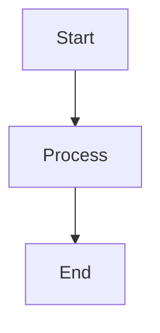
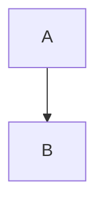

# Document Preprocessing Guide

Complete guide to document preprocessing in RAG-lite TS, including content type handling, configuration options, and optimization strategies.

## Table of Contents

- [Overview](#overview)
- [Supported File Types](#supported-file-types)
- [Preprocessing Modes](#preprocessing-modes)
- [Content Type Processing](#content-type-processing)
- [Configuration](#configuration)
- [Use Cases](#use-cases)
- [Troubleshooting](#troubleshooting)

## Overview

RAG-lite TS includes a powerful preprocessing system that handles various content types beyond plain Markdown, ensuring optimal embedding generation and search quality.

### Why Preprocessing Matters

- **Clean Embeddings**: Remove noise that could confuse semantic understanding
- **Content Extraction**: Extract meaningful text from complex formats
- **Consistent Processing**: Handle different file types uniformly
- **Optimization**: Balance between information preservation and embedding quality

## Supported File Types

### Text-Based Content

#### Markdown (.md)
Standard Markdown files with full syntax support.

**Processing:**
- Headers, lists, links, emphasis preserved
- Code blocks handled based on configuration
- Tables converted to structured text

#### Text (.txt)
Plain text files processed as-is.

**Processing:**
- Minimal processing
- Line breaks and paragraphs preserved
- No special syntax handling

#### MDX (.mdx)
Markdown with JSX components, common in documentation sites.

**Processing:**
- JSX components handled based on configuration
- Markdown content processed normally
- Import/export statements filtered

**Example input:**
```mdx
# API Documentation

<ApiEndpoint method="POST" url="/auth/login">
  Login endpoint for user authentication
</ApiEndpoint>

Regular markdown content here.

<CodeExample language="javascript">
const response = await fetch('/auth/login');
</CodeExample>
```

#### PDF (.pdf)
Portable Document Format files.

**Processing:**
- Text extraction from PDF content
- Metadata preservation (title, author)
- Page breaks handled as paragraph boundaries
- Images and complex layouts simplified

#### DOCX (.docx)
Microsoft Word documents.

**Processing:**
- Text content extraction
- Heading structure preserved
- Tables converted to text
- Comments and track changes ignored

### Multimodal Content (Available in Multimodal Mode)

#### Images (.jpg, .jpeg, .png, .gif, .webp)
Image files processed for multimodal search capabilities.

**Processing:**
- **Image-to-text conversion**: Automatic description generation using Xenova/vit-gpt2-image-captioning
- **Metadata extraction**: Dimensions, file size, format, creation date using Sharp
- **Content-type preservation**: Images stored with content_type='image' for proper handling
- **Searchable descriptions**: Generated descriptions indexed for text-based search

**Example processing:**
```
Input: architecture-diagram.png (1920x1080, 245KB)

Generated description: "A diagram showing system architecture with multiple connected components and data flow arrows"

Extracted metadata:
{
  "dimensions": {"width": 1920, "height": 1080},
  "fileSize": 251392,
  "format": "png",
  "originalPath": "./docs/images/architecture-diagram.png",
  "description": "A diagram showing system architecture..."
}
```

#### Mixed Content Directories
Directories containing both text and image files.

**Processing:**
- **Automatic content-type detection**: Files processed based on extension
- **Unified indexing**: Both text and images indexed in same database
- **Cross-content search**: Text queries can find relevant images through descriptions
- **Consistent chunking**: Images treated as single chunks with generated descriptions

## Preprocessing Modes

### Strict Mode
Maximum cleanup for the cleanest possible embeddings.

**Characteristics:**
- Removes all JSX components
- Strips Mermaid diagrams entirely
- Removes code blocks
- Minimal noise in embeddings
- **Multimodal**: Images processed with minimal metadata, focus on generated descriptions

**Best for:**
- Pure content search
- Non-technical documentation
- When embedding quality is critical
- Clean multimodal search without metadata noise

**Configuration:**
```javascript
preprocessing: {
  mode: 'strict',
  overrides: {
    mdx: 'strip',      // Remove JSX components
    mermaid: 'strip',  // Remove diagrams
    code: 'strip',     // Remove code blocks
    images: 'description-only'  // Only use generated descriptions
  }
}
```

### Balanced Mode (Default)
Practical compromise between information and cleanliness.

**Characteristics:**
- Replaces JSX with `[component removed]` placeholders
- Replaces diagrams with `[diagram removed]` placeholders
- Preserves code blocks for technical documentation
- Good balance for most use cases
- **Multimodal**: Images processed with descriptions and key metadata

**Best for:**
- Technical documentation
- Mixed content types
- General-purpose search
- Multimodal content with balanced information retention

**Configuration:**
```javascript
preprocessing: {
  mode: 'balanced',
  overrides: {
    mdx: 'placeholder',    // Replace with placeholders
    mermaid: 'placeholder', // Replace with placeholders
    code: 'keep',          // Preserve code blocks
    images: 'description-with-metadata'  // Descriptions + essential metadata
  }
}
```

### Rich Mode
Preserves maximum information for comprehensive search.

**Characteristics:**
- Keeps JSX components for potential semantic extraction
- Extracts Mermaid diagram relationships as text
- Preserves all code blocks
- Maximum information retention
- **Multimodal**: Images processed with full metadata, descriptions, and file information

**Best for:**
- Code documentation
- Technical specifications
- When completeness is more important than cleanliness
- Comprehensive multimodal search with all available information

**Configuration:**
```javascript
preprocessing: {
  mode: 'rich',
  overrides: {
    mdx: 'keep',       // Keep JSX components
    mermaid: 'extract', // Extract diagram content
    code: 'keep',      // Keep all code blocks
    images: 'full-metadata'  // Complete metadata + descriptions + file info
  }
}
```

### Multimodal Mode (New)
Specialized mode for mixed content with optimized multimodal processing.

**Characteristics:**
- Optimized for text and image content processing
- Enhanced image-to-text generation with context
- Intelligent content-type routing
- Balanced processing for multimodal search quality

**Best for:**
- Documentation with diagrams and screenshots
- Mixed media content collections
- Visual content search
- Multimodal RAG applications

**Configuration:**
```javascript
preprocessing: {
  mode: 'multimodal',
  overrides: {
    mdx: 'keep',       // Preserve components for context
    mermaid: 'extract', // Extract diagram relationships
    code: 'keep',      // Keep code for technical context
    images: 'enhanced-description'  // Enhanced image processing with context
  },
  multimodalOptions: {
    imageToTextModel: 'Xenova/vit-gpt2-image-captioning',
    includeImageMetadata: true,
    contextualDescriptions: true,  // Use surrounding text for better descriptions
    batchImageProcessing: true     // Process multiple images efficiently
  }
}
```

## Content Type Processing

### JSX Component Handling

**Strip Mode:**
```mdx
# Input
<Button onClick={handler}>Click me</Button>

# Output
(component completely removed)
```

**Placeholder Mode:**
```mdx
# Input
<Button onClick={handler}>Click me</Button>

# Output
[component removed]
```

**Keep Mode:**
```mdx
# Input
<Button onClick={handler}>Click me</Button>

# Output
<Button onClick={handler}>Click me</Button>
```

### Mermaid Diagram Processing

**Strip Mode:**
```markdown
# Input


# Output
(diagram completely removed)
```

**Placeholder Mode:**
```markdown
# Input


# Output
[diagram removed]
```

**Extract Mode:**
```markdown
# Input


# Output
Diagram: Start connects to Process, Process connects to End
```

### Code Block Processing

**Strip Mode:**
```markdown
# Input
```javascript
function hello() {
  console.log('Hello world');
}
```

# Output
(code block completely removed)
```

**Keep Mode:**
```markdown
# Input
```javascript
function hello() {
  console.log('Hello world');
}
```

# Output
```javascript
function hello() {
  console.log('Hello world');
}
```
```

**Placeholder Mode:**
```markdown
# Input
```javascript
function hello() {
  console.log('Hello world');
}
```

# Output
[code block removed]
```

## Configuration

### Configuration File

```javascript
// raglite.config.js
export const config = {
  preprocessing: {
    mode: 'balanced',  // 'strict', 'balanced', or 'rich'
    
    // Override specific content types
    overrides: {
      mdx: 'placeholder',     // 'strip', 'keep', or 'placeholder'
      mermaid: 'extract',     // 'strip', 'extract', or 'placeholder'
      code: 'keep'            // 'strip', 'keep', or 'placeholder'
    }
  }
};
```

### Environment Variables

```bash
# Set preprocessing mode
export RAG_PREPROCESSING_MODE="balanced"

# Override specific content types
export RAG_PREPROCESSING_MDX="placeholder"
export RAG_PREPROCESSING_MERMAID="extract"
export RAG_PREPROCESSING_CODE="keep"
```

### Programmatic Configuration

```typescript
import { preprocessDocument } from 'rag-lite-ts';

const config = {
  mode: 'balanced',
  overrides: {
    mdx: 'placeholder',
    mermaid: 'extract',
    code: 'keep'
  }
};

const processed = preprocessDocument(content, filePath, config);
```

## Use Cases

### Technical Documentation

**Scenario**: API documentation with code examples and diagrams

**Recommended configuration:**
```javascript
preprocessing: {
  mode: 'rich',
  overrides: {
    mdx: 'keep',       // Preserve API components
    mermaid: 'extract', // Extract diagram relationships
    code: 'keep'       // Keep code examples
  }
}
```

**Benefits:**
- Code examples searchable
- Diagram relationships indexed
- API components preserved for context

### User Guides

**Scenario**: End-user documentation with minimal technical content

**Recommended configuration:**
```javascript
preprocessing: {
  mode: 'strict',
  overrides: {
    mdx: 'strip',      // Remove technical components
    mermaid: 'strip',  // Remove complex diagrams
    code: 'strip'      // Remove code blocks
  }
}
```

**Benefits:**
- Clean, readable content
- Focus on user-facing information
- Better semantic understanding

### Mixed Content Collections

**Scenario**: Documentation with both technical and user content

**Recommended configuration:**
```javascript
preprocessing: {
  mode: 'balanced',  // Default balanced approach
  overrides: {
    mdx: 'placeholder',    // Indicate removed components
    mermaid: 'placeholder', // Indicate removed diagrams
    code: 'keep'           // Preserve important code
  }
}
```

**Benefits:**
- Handles diverse content types
- Maintains searchability
- Reasonable embedding quality

### Code Documentation

**Scenario**: Internal code documentation and specifications

**Recommended configuration:**
```javascript
preprocessing: {
  mode: 'rich',
  overrides: {
    mdx: 'keep',       // Keep all components
    mermaid: 'extract', // Extract architecture info
    code: 'keep'       // Essential for code docs
  }
}
```

**Benefits:**
- Complete information preservation
- Code examples fully searchable
- Architecture diagrams indexed

## Advanced Configuration

### File-Type Specific Processing

```javascript
// Different processing for different file types
preprocessing: {
  mode: 'balanced',
  fileTypeOverrides: {
    '.mdx': {
      mdx: 'keep',       // Keep JSX in MDX files
      code: 'keep'
    },
    '.md': {
      mdx: 'strip',      // No JSX expected in MD files
      code: 'placeholder'
    }
  }
}
```

### Content-Based Processing

```javascript
// Different processing based on content patterns
preprocessing: {
  mode: 'balanced',
  contentRules: [
    {
      pattern: /api\/.*\.md$/,  // API documentation
      overrides: { code: 'keep', mermaid: 'extract' }
    },
    {
      pattern: /guides\/.*\.md$/, // User guides
      overrides: { code: 'strip', mermaid: 'strip' }
    }
  ]
}
```

### Custom Processors

```typescript
import { registerPreprocessor } from 'rag-lite-ts';

// Register custom processor for specific content
registerPreprocessor('custom-component', {
  pattern: /<CustomComponent[^>]*>.*?<\/CustomComponent>/gs,
  handler: (match) => '[custom component processed]'
});
```

## Performance Impact

### Processing Speed by Mode

| Mode | Speed | Quality | Use Case |
|------|-------|---------|----------|
| Strict | Fastest | Cleanest | Pure content search |
| Balanced | Medium | Good | General purpose |
| Rich | Slowest | Complete | Technical documentation |

### Memory Usage

- **Strict**: Lowest memory usage (less content to process)
- **Balanced**: Moderate memory usage
- **Rich**: Highest memory usage (preserves all content)

### Embedding Quality

- **Strict**: Highest semantic clarity, lowest noise
- **Balanced**: Good balance of information and clarity
- **Rich**: Maximum information, potential noise from code/markup

## Troubleshooting

### Common Issues

**Problem**: Search results missing expected content
```javascript
// Solution: Use less aggressive preprocessing
preprocessing: {
  mode: 'rich',  // or 'balanced' instead of 'strict'
  overrides: {
    code: 'keep'  // Ensure code blocks are preserved
  }
}
```

**Problem**: Poor search quality with technical content
```javascript
// Solution: Use stricter preprocessing
preprocessing: {
  mode: 'strict',
  overrides: {
    mdx: 'strip',     // Remove noisy components
    code: 'strip'     // Remove code noise
  }
}
```

**Problem**: JSX components causing parsing errors
```javascript
// Solution: Strip or replace problematic JSX
preprocessing: {
  mode: 'balanced',
  overrides: {
    mdx: 'placeholder'  // Replace with safe placeholders
  }
}
```

**Problem**: Mermaid diagrams not processed correctly
```bash
# Ensure diagrams are in proper code blocks


# Not just:
graph TD
    A --> B
```

### Debug Preprocessing

```typescript
import { preprocessDocument, getPreprocessingStats } from 'rag-lite-ts';

const original = '# Title\n<Component>content</Component>';
const processed = preprocessDocument(original, 'test.mdx');
const stats = getPreprocessingStats(original, processed);

console.log('Original length:', stats.originalLength);
console.log('Processed length:', stats.processedLength);
console.log('Reduction:', stats.reductionPercentage + '%');
```

### Validation

```bash
# Test preprocessing with debug mode
DEBUG=1 raglite ingest ./docs/

# Check preprocessing output in logs
# Look for "Preprocessed: [filename]" entries
```

This guide covers all aspects of document preprocessing. Choose the mode and overrides that best match your content type and search requirements.